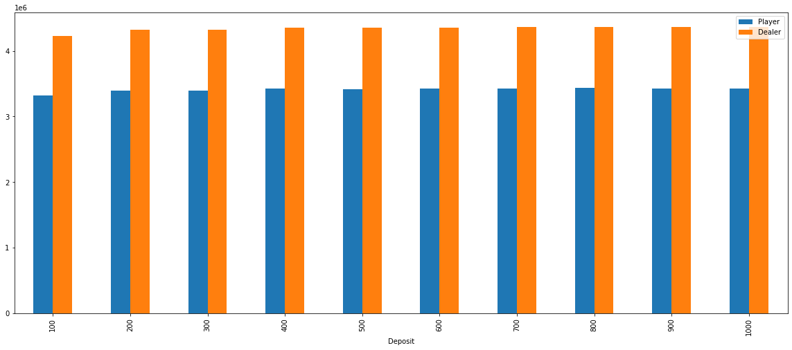
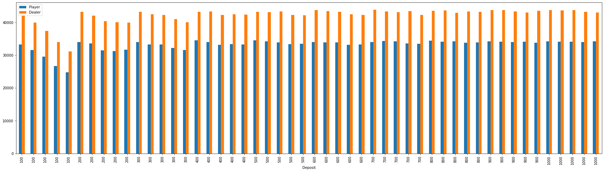

# Blackjack | Stochastic Phenomena Simulation with Python
 &nbsp;
 &nbsp;
[](https://github.com/damnicolussi/blackjack/)
<br>
This project is a Python-based simulation of a stochastic phenomenon - specifically, a game of blackjack. It was developed as part of a school project to explore the dynamics of the game and study the influence of various parameters on the outcomes.

## Project Requirements

The simulation aims to replicate a game of blackjack under specific conditions:

- Each game starts with an initial bet of 5 units.
- The player follows a betting strategy: "if the player wins, they bet the same amount again; otherwise, they bet double."
- The decision to draw a new card is based on the player's calculation of the probability of drawing a card that is advantageous. The probability threshold 'p' is randomly chosen in the range of 20% to 100% for each hand.
- The game continues until the player doubles the initial amount, loses everything, or runs out of cards in the deck.
- The initial amount is set to 100, and 1 million matches are simulated.

## Project Structure

The project files can be found in the `src` folder.
- `blackjack_simulation.ipynb`
- `blackjack_simulation.py`

## Results

### Simulation 1 (deposit change, bet is set to 5)
```
   Deposit  Player (%)  Dealer (%)
0      100   43.970291   56.029709
1      200   43.976538   56.023462
2      300   43.987809   56.012191
3      400   43.977848   56.022152
4      500   43.983925   56.016075
5      600   43.997499   56.002501
6      700   43.976616   56.023384
7      800   43.998070   56.001930
8      900   43.971419   56.028581
9     1000   43.977098   56.022902
```



### Simulation 2 (deposit change, bet change)
```
    Deposit  Bet  Player  Dealer  Player (%)  Dealer (%)
0       100    5   33227   42403   43.933624   56.066376
1       100   10   31564   39951   44.136195   55.863805
2       100   15   29528   37356   44.148077   55.851923
3       100   20   26679   34031   43.944984   56.055016
4       100   25   24777   31162   44.292890   55.707110
5       200    5   34028   43266   44.024116   55.975884
6       200   10   33551   42102   44.348539   55.651461
7       200   15   31403   40371   43.752612   56.247388
8       200   20   31243   40089   43.799417   56.200583
9       200   25   31642   39937   44.205703   55.794297
10      300    5   34009   43219   44.037137   55.962863
11      300   10   33240   42428   43.928741   56.071259
12      300   15   33292   42305   44.038785   55.961215
13      300   20   32164   40996   43.963915   56.036085
14      300   25   31566   40020   44.095214   55.904786
15      400    5   34525   43264   44.382882   55.617118
16      400   10   34010   43344   43.966699   56.033301
17      400   15   33125   42279   43.930030   56.069970
18      400   20   33361   42431   44.016519   55.983481
19      400   25   33270   42416   43.957931   56.042069
20      500    5   34520   43243   44.391291   55.608709
21      500   10   34198   43108   44.237187   55.762813
22      500   15   33928   43294   43.935666   56.064334
23      500   20   33335   42261   44.096248   55.903752
24      500   25   33416   42200   44.191705   55.808295
25      600    5   33991   43738   43.730139   56.269861
26      600   10   33897   43427   43.837618   56.162382
27      600   15   33941   43230   43.981547   56.018453
28      600   20   33113   42528   43.776523   56.223477
29      600   25   33211   42240   44.016647   55.983353
30      700    5   34019   43910   43.653839   56.346161
31      700   10   34364   43374   44.204893   55.795107
32      700   15   34163   43129   44.199917   55.800083
33      700   20   33602   43464   43.601588   56.398412
34      700   25   33435   42240   44.182359   55.817641
35      800    5   34424   43568   44.137860   55.862140
36      800   10   34138   43690   43.863391   56.136609
37      800   15   34212   42937   44.345358   55.654642
38      800   20   33821   43289   43.860718   56.139282
39      800   25   33858   43212   43.931491   56.068509
40      900    5   34226   43803   43.863179   56.136821
41      900   10   34069   43724   43.794429   56.205571
42      900   15   33969   43306   43.958589   56.041411
43      900   20   34089   43023   44.207127   55.792873
44      900   25   33821   43487   43.748383   56.251617
45     1000    5   34232   43758   43.892807   56.107193
46     1000   10   34126   43617   43.895913   56.104087
47     1000   15   34081   43723   43.803660   56.196340
48     1000   20   33945   43232   43.983311   56.016689
49     1000   25   34180   43024   44.272317   55.727683
```



## Conclusions

The obtained house payout percentages fluctuate within the range of 54% to 56%. An online search reveals that various studies indicate the house's payout percentage is typically around 51%. Therefore, it can be concluded that the data obtained closely aligns with reality. It's important to note that certain aspects have been either overlooked or significantly simplified in the simulation. For instance, the player's audacity during a game, which in the program's case is randomly determined, is one such simplified element.

## Useful Links
* This Repository: https://github.com/damnicolussi/blackjack/
* License: https://github.com/damnicolussi/blackjack/blob/main/LICENSE

*If you find any issues or do you have any suggestion please create a pull request or report an issue*
